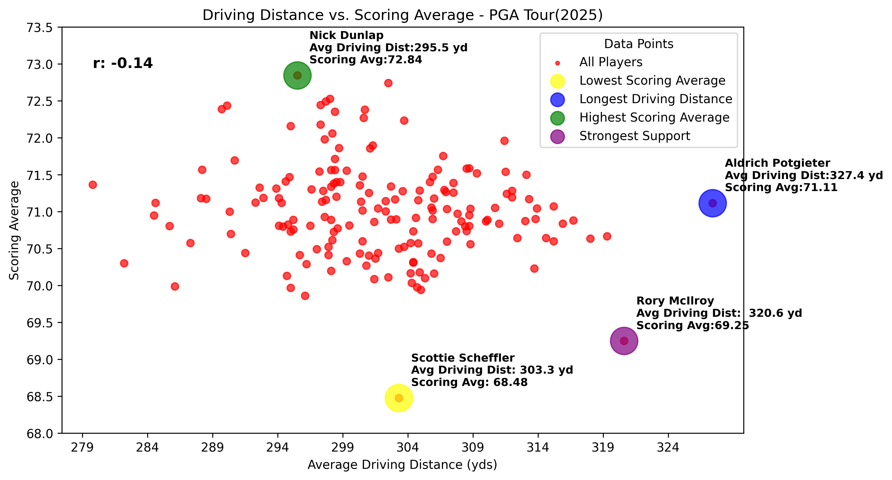

# PGA Tour 2025: Driving Distance vs Scoring Average. 

Tools: Python, Pandas, Numpy, Matplotlib, and Jupyter Notebook

This project explores the relationship between 'Driving Distance" and 'Scoring Average' using PGA Tour statistics from the 2025 season. The key obejective is to investigate and determine whether longer drives lead to a lower scoring average. 

The game of golf is fluid, technology is changing and the governing associations are needing to adapt the rules to keep up with the modern game. In recent years, Driver heads have become lighter, faster, new materials are being discovered to increase parameters such as ballspeed and shapes are being refined to reduce drag, increasing in how fast the player can move the club through the air during their swing. While the clubhead and players ability is a factor in how far they can hit it, another factor is the ball. Governing associations for the Rules of Golf have begun to implement a new rule against the golf ball that would have a direct impact on distance statistics for professionals. The aim at the reduction in distance, is in my opinion, to protect classic and historical golf courses that modern day professionals overpower with their great distance. The latter is the reason I initiated this project; to answer the question "Does hitting the ball farther actually lead to lower scores?" - Let's find out! 

After collecting multiple csv files containing the information required to complete the task (Driving Distance and Scoring Average), the data files weren't clean enough for a clean DataFrame or plotting attempt, so the first step was to clean each file by renaming each column to match the appropriate output parameters. Once the data was cleaned, there were still two files which need to become one.. so it was time to merge, sort and apply further analysis parameters to better suit the output. 

Analysis: After cleaning and properly formatting the data, setting it in DataFrame and plotting in Scatter format and calculating a Pearson correlation, the data suggests that with a coefficient of (-0.14) the relationship between longer drives and lower scores is relatively weak. While longer drives CAN lead to lower scores, they are not a direct influence on the players score, as many factors come into play. A majority of the players were plotted with a scoring average between 70 and 72 regardless of their driving distance. Of course, there were a few outliers and those were highlighted on the chart to outline their superior or inferior performance data in either metric. As the study confirms, the player with the longest driving distance (Aldrich Potgieter), has a scoring average that's 2.63 strokes higher than the scoring average leader, and World #1 (Scottie Scheffler), while boasting an average driving distance that is 24.1 yards longer than Scheffler. Even though there is a weak correlation between the two data points, Rory McIlroy displays the strongest support for the correlation of all PGA Tour players. Currently #2 in the World Rankings, Rory ranks #2 in Driving Distance and Scoring Average in both PGA Tour stat categories. Rory would in theor, be the sole indicator that long drives do lead to lower scores, but in fact, accuracy, and strokes gained metrics play a significant role in his sucess. We can explore that data at a later time. To conclude, the data does not support the theory that longer drives lead to lower scores, golf courses aren't entirely being overpowered as some governing associations might believe. Player's continue to upskill, their talents become greater at a younger age and the modern game will continue to prove that high level talent in all skill areas is the leading factor in lower scores. 

